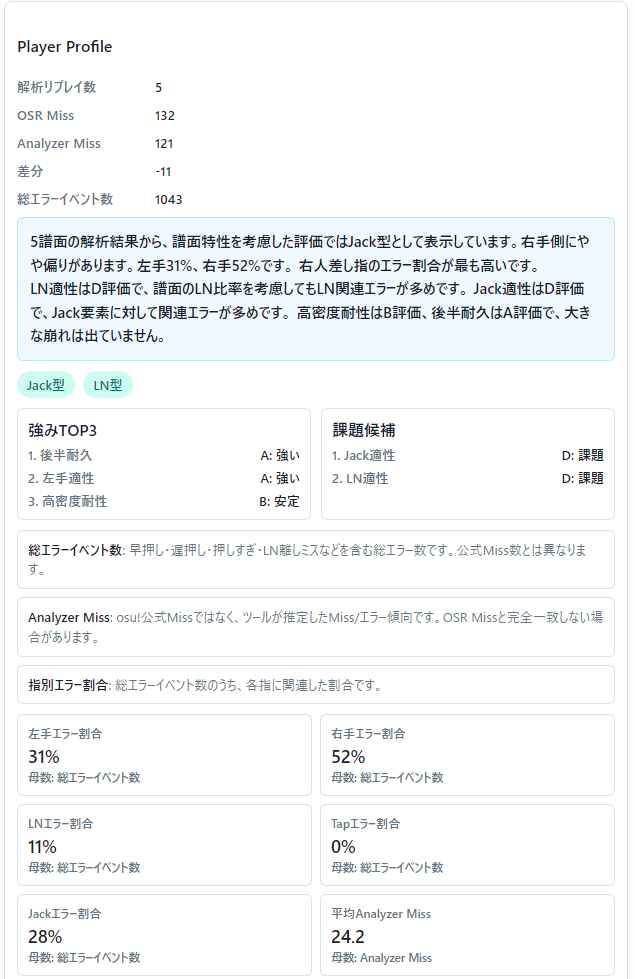
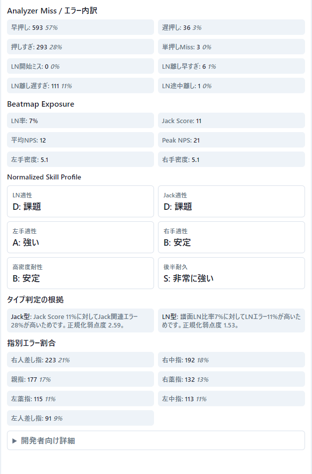

# osu!mania Skill Analyzer v1.0.0

osu!maniaのリプレイ（.osr）と譜面ファイル（.osu）を解析し、プレイヤーの入力傾向・ミス傾向・譜面適性を可視化する分析ツールです。

公式のスコアやPPだけでは分からない、

* どの指でミスしやすいのか
* 左右どちらが弱いのか
* LN（Long Note）が得意か苦手か
* Jack配置への適性はあるか
* 高密度地帯で崩れやすいか
* 後半で体力切れを起こしているか

といった情報を分析できます。

---

## 主な機能

### 単体リプレイ解析

* .osr リプレイ読み込み
* .osu 譜面読み込み
* Analyzer Miss計測
* 指別ミス分析
* 左右バランス分析
* エラー内訳表示

### 複数リプレイ統合解析

* 最大5譜面を同時解析
* プレイヤープロファイル生成
* 指別傾向集計
* LN適性分析
* Jack適性分析
* 高密度耐性分析
* 後半耐久分析
* 譜面特性を考慮した正規化評価

---

## Player Profile

本ツールでは複数譜面の結果を統合し、

* 強みTOP3                                                                                              
* 課題候補
* 指別エラー割合
* 譜面適性                                           
* 総合傾向

を自動生成します。

単一譜面の結果ではなく、複数譜面の傾向からプレイヤー特性を分析することを目的としています。

### Player Profile Screenshot

---

## 対応状況

### v1.0.0

* Replay Analyzer実装
* Player Profile実装
* Normalized Skill Profile実装
* 指別分析実装
* LN適性分析実装
* Jack適性分析実装
* 複数譜面統合分析実装

---

## 今後のアップデート予定

### v1.1

* MOD対応改善
* Analyzer Miss精度改善
* 解析結果表示改善

### v1.2

* 譜面特性分析強化
* プロファイル判定精度向上

### v1.3以降

* 上位プレイヤーデータとの比較研究
* 評価アルゴリズム改善
* 新指標追加

---

## 注意事項

本ツールは練習支援および傾向分析を目的としています。

Analyzer Missは独自推定値であり、osu!公式Miss数と完全一致することは保証されません。

分析結果は参考情報として利用してください。

---

## 開発

開発者: Ruikosan

開発支援:

* ChatGPT
* OpenAI Codex

AI支援を活用しながら設計・実装・検証を行っています。

---

## License

MIT License
